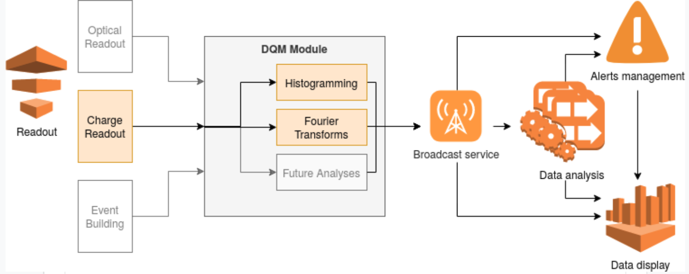
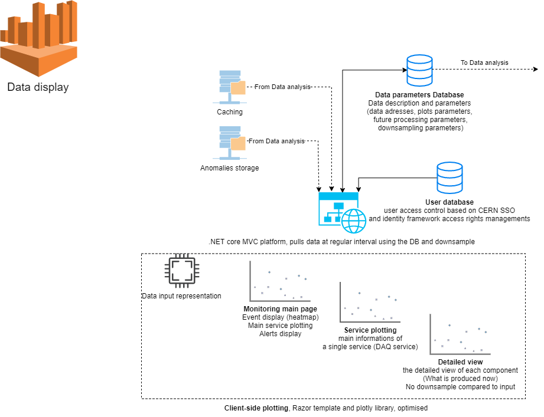
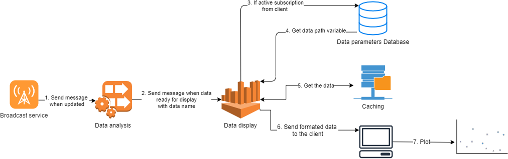
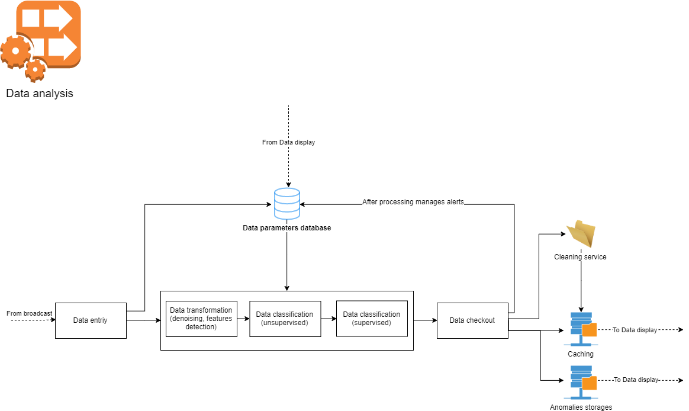
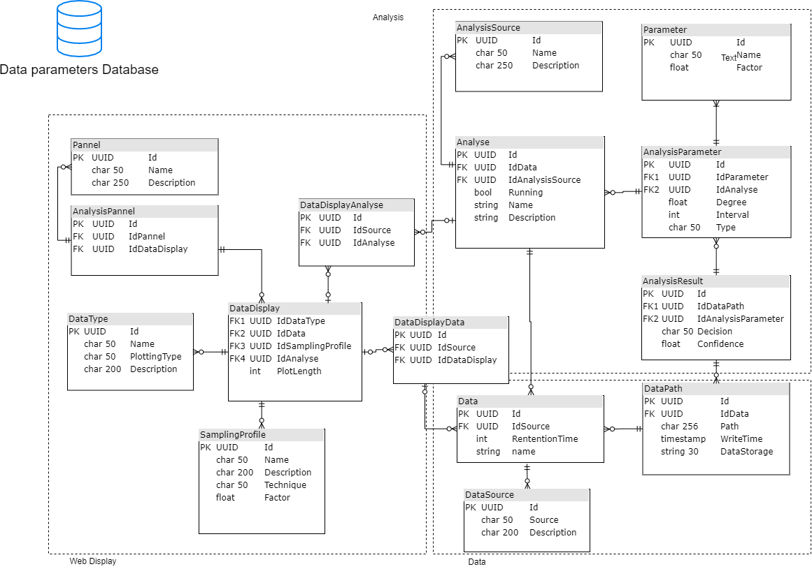
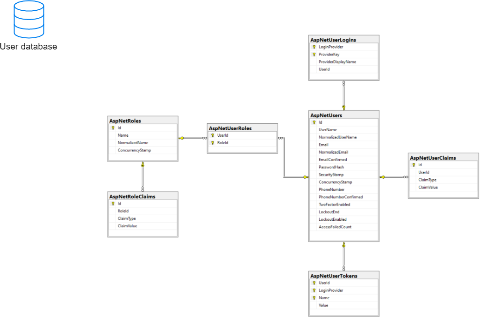

# Monitoring platform

The monitoring platform is a collection of services handling DUNE Data Quality Monitoring, from readout to analysis display.

The platform is divided in two organisational units, the local process (left part on \reffig:ArchitectureOverview-Master) and the remote processing (right part on \reffig:ArchitectureOverview-Master). The local processing  is a group of services close to the experiment hardware, they are contained in the "dqm" module of the DAQ-application framework and aims to process, in real time, readout outputs. The results of this processing is then sent to the remote processing. This second handles the distribution of the data to all the consumers (broadcast service), the data analysis though a series of mini-services, the data display through a web platform.

## Broadcast service
The broadcast service's task is to be the broker between all the platform's services. The main data inputs comes from the DQM module, producing the readout's transformed data, and from the data analysis mini-services, transforming the DQM module's outputs for specific applications (such as display or specific analysis approaches).

The broadcast technology is interchangeable, the platform's need of the technology being well under what the market can offer. The key requirements are for the broker to be fast, reliable, scalable and offer a maximum of compatibility with different programming languages that are or could be used in the infrastructure.  

#### CERN Apache Kafka cluster
CERN IT service offers kafka as a service \footnotekafka.web.cern.ch - nile-user-guide.web.cern.ch/kafka/. This strongly contributed in the broker choice for the first part of the development as it offers a reliable, scalable and directly available resource. 

CERN Apache Kafka cluster is set to process or store for up to 30 days or until processed. 

The access management to the server is made through the dune-dqm-broker e-group. Members of the e-group can produce and consume on all the topics mentioned hereafter. They need to authenticate through certificates, this authentication is explained in \refKafkaConfig.

##### Kafka topics
The following topics are used in the broker. It is important to subscribe to the relevant one for producing or consuming. Failing to do so could corrupt the functioning of a given script. For the creation of new topic, forward a request to the documentation creators.

Available topics are:
 - First DQM module outputs : dunedqm-incommingchannel1
 - Second DQM module outputs (not in use) : dunedqm-incommingchannel2
 - Topic consumed by the web platform, every sent data will be automatically sent there : dunedqm-platforminputs
 - Data post processing channel : dunedqm-processedchannel1

#### Secondary Apache Kafka cluster
A spare kafka instance is available, this one with no authentication needed at 188.185.122.48. All topics are replicated. The platform is hosted on a CERN openstack docker.

#### Message structure
There are two distinct data structure, the outputs produced by a functional elements creating the data (ex: DQM module), and the outputs produced by the elements processing the data (ex: data transformation sub-service). The main distinction between them is that while the first category contains the physics data, in order to transport them to the data handling process, the second is used as a notification message, carrying information about new inputs and how to access their data. Having both allows to transport the data when necessary, but once a data is available in the database service, it doesn't load the server by being transmitted again through Kafka.

#### Creation service : 
dataSourceName + ";" + dataName + ";" + run + ";" + subRun + ";" + event + ";" + timeStamp + ";" + metadata + ";" + content
 - The name of the system producing the : datadataSourceName 
 - The name of the sub-system producing the : datadataName 
 - The run number : run 
 - The sub-run number : subRun
 - The event id : event
 - The time of the event : timeStamp
  - Free-form metadata : metadata
 - The physics data produced : content
Those messages uses the semicolon ";" separator.

#### Processing service : 
dataId + "," + recordId + "," + dataPath + "," + storageType

 - Identifier of the sub-system producing the data (allows for a platform to check if they are subscribed to it) : dataId 
 - Record id in the database : recordId 
 - Path to access the data without querying the database : dataPath 
 - Data encoding : storageType Those messages uses the period "," separator.

## Display service
The monitoring platform is the interface allowing to display the DQM module outputs, analysis results and to set analysis parameters.

The platform's architecture main constraint is its speed. It has to be able display to clients plots in real time, with a minimum of influence from the amount of clients connected. This implies the platform is informed of all plots update and selects the one clients are subscribed to at a given time, to avoid loosing time in gathering or displaying unnecessary data.

### Technologies
The display service consist of a web platform, using the MVC architecture. The platform is deployed on CERN's openshift OKD4 platform. It runs on an Apache server using .NET Core SDK 3.1.107 and .NET Core Runtime 3.1.7.

The framework choice key factor were mainly:
 - Open source and cross-platform
 - Performance
 - Native data querying implementation
 - WebSockets implementation
 - Asynchronous programming pattern implementation
 - Presence in the industry
 - Object–relational mapping framework integration in the infrastructure 

The following packages are used in the back-end:
 - Confluent.Kafka                                           1.6.3\footnoteConfluent developped/maintained .NET library for kafka brokers, https://docs.confluent.io/clients-confluent-kafka-dotnet/current/overview.html 
 - Microsoft.AspNetCore.Diagnostics.EntityFrameworkCore      3.1.13\footnoteLightweight Entity Framework data access, open source and cross-platform version, https://docs.microsoft.com/en-us/ef/core/
 - Microsoft.AspNetCore.Identity.EntityFrameworkCore         3.1.15\footnoteAPI based entity builder for authentication, https://docs.microsoft.com/en-us/aspnet/core/security/authentication/identity
 - Microsoft.AspNetCore.Identity.UI                          3.1.15\footnoteAPI based user interface for authentication, https://docs.microsoft.com/en-us/aspnet/core/security/authentication/identity 
 - Npgsql.EntityFrameworkCore.PostgreSQL                     3.1.11\footnoteNpgsql's Entity Framework Core provider, https://www.npgsql.org/efcore/
 - Microsoft.AspNetCore.Authentication.OpenIdConnect         3.1.13\footnoteTypes library enabling OpenIdConnect based authentication support, https://docs.microsoft.com/en-us/dotnet/api/microsoft.aspnetcore.authentication.openidconnect
 - Microsoft.AspNetCore.Authentication.JwtBearer             3.1.16\footnoteMiddleware enabling receiving OpenID Connect bearer tokens, https://www.nuget.org/packages/Microsoft.AspNetCore.Authentication.JwtBearer
 - Microsoft.AspNetCore.Authentication.Cookies               2.2.0\footnoteAuthentication provider outside identity (for OpenIdConnect), https://docs.microsoft.com/en-us/aspnet/core/security/authentication/cookie 
 - Microsoft.EntityFrameworkCore.Tools                       3.1.15\footnoteEnables database migration control in PowerShell, https://www.nuget.org/packages/Microsoft.EntityFrameworkCore.Tools 

The following packages are used in the front-end:
 - plotly.js                                                 1.58.4\footnoteDeclarative charting library, https://plotly.com/javascript/
 - vanillaSelectBox                                          0.59\footnoteJs multi-select user interface for drop-downs, https://github.com/PhilippeMarcMeyer/vanillaSelectBox
 - Bootstrap                                                 4.3.1\footnoteResponsive CSS framework, https://getbootstrap.com/docs/4.0/utilities/flex/ 
 - jQuery                                                    3.5.1\footnoteJavaScript library, https://jquery.com/ 
 - signalR                                                   3.1.16\footnoteOpen-source library for high frequency server-client update, https://docs.microsoft.com/en-us/aspnet/core/signalr/

### Program architecture
As mentioned earlier, the platform is based on the MVC architecture. The following section will detail the platform's main functionalities.
#### wwwroot
This directory separates code files and static files and is treated as a web root folder. Meaning the client side libraries are stored there, together with the scripts necessary for client side interactions and display.
##### chart.js
Chart.js contains the signalR Hub connection builder, which allows sending and receiving server side invocations. The script contains the data plotting features including: display, data transformation to plot type (histograms, scatters,..), and plot updating.
#### Areas
In ASP.net, the areas are functional groups. In this project, only the Identity functional group is used there. Identity pages in the project are a scaffold of Identity Framework. 

##### Login
Controller for the login page, it is set to connect to an external or internal provider necessary authentication. The controllers redirects to ExternalLogin, allowing to directly get on CERN's authentication platform. To reactivate the embedded authentication or add other providers, the redirection in the OnGetAsync method should be removed and the view modified to add the new redirection.
##### ExternalLogin
The controller is built after the external authentication. The OnPost takes the token answer fro
m the external provider and Sign in the user in the identity context.
##### RegisterConfirmation
Creates new users in the Identity context. Identity is used to manage the user authorizations, security tokens and contacts inside the application, after the token is first validated, an Identity user is created and accessed at each connection, through the token.

#### Controllers
Contains all the controllers, it contains the flow control logic of the application. All the controllers contains the CRUD operations and are scaffold formatted. Controllers varying from this format are described hereafter:

The controllers classes and methods contains the authorisations management.

##### Pannels and DataDisplays Controllers
Those controllers implements a selector configuration for many-to-many relationship management.

##### AspRoles Controller
Implement a simplified roles management interface.

#### Data
The platform uses the code first approach, creating and updating the database through Entity Framework, by updating the models.

The Data folder contains the database context configuration, in inherits from Entity's DbContext and implements the models. It is also where the NpgSQL connector is used to connect to the database. to edit the Database Management System (DBMS), the connector used should be modified here and later as described in the "startup" chapter.
##### Monitoring DB Context
This context overrides the DbContext's OnModelCreating, and changes the model builder to force "on delete cascade" in the database behaviour. This implementation is cleaner that an item specific deletion behaviour in the controllers given the database architecture.

##### User DB Context
This context uniherit's from IdentityDbContext, itself inheriting from DbContext, but implementing the identity classes.

#### Hubs
SignalR Hubs API enables to call methods on clients from the server and vice-versa. Plots generation and update is managed in the two classes of this folder.

##### ChartHub
ChartHub is the default connection between the client-side JavaScript and the server. The class can be injected in all classes, allowing to call its function, or the ones it inherits, making possible to send data through the hubs, from controllers.

ChartHub handles small functionalities as updating the timestamp when it is displayed or saving panels. It also contains three core functionalities, selecting plots data (GetDisplayList), selecting plots data from a given time (GetDisplayAtTime), and selecting plots data for update from a given time (UpdateDisplayFromTime, less preforment than the process update as a service, it display changes at a 1 second rate and is design to review data inputs). It doesn't send the plot data to the clients, as developped in the next chapter. The hub instead creates a chartDataMessenger event, sending a ChartUpdate object. This object describes the object to be sent to the client. 

A key functionality managed by this hub is, through the override of the "OnConnectedAsync/OnDisconnectedAsync" functions, to maintain a list of "ConnectedClient" objects. This static list contains the clients currently requesting data and the list of data for each of them, it serves the data kafka consumer to send in processing subscribed data only.

##### ChartDataHubContext
ChartHub instances are initiated my individual clients, to serve once and once only each client from any point in the application while preserving performance ChartHub could therefore not be used, thus the use of ChartDataHubContext.

ChartDataHubContext is initiated in Main after the host builder, allowing to catch the IHubContext service and pass it to the builder, at this point, no connection is established but the object is accessible. ChartDataHubContext is therefore not a hub but can access the HubContext once it is connected.
It is subscribed to the chartDataMessenger incoming events and upon reception processes a ChartUpdate, reading the necessary amount of data files to build a display. The class reads and format the information for the clients before sending it as a ChartUpdate object through the hub.

#### Messengers
The messengers are lazy (for thread safety) singleton pattern event handlers. They allow thread safe parallel handling of inputs from different consumers inside the platform. This approach does serves two purposes. the fist is it simplifies the instantiating and communication between the hubs and hub contexts, and between hubs and the services. The second is it allows to serve data display and anomaly report displays from the same data in parallel.

##### InputsMessenger
Is used to transport Kafka messages from consumers to data selectors.

##### ChartDataMessenger
Is used to transport ChartData objects from data selectors to the data reading from storage services.

#### Migrations
Migrations create and incrementally update the DB schema, synchronising it with the application's data model while preserving the database integrity. The creation or modification of the database (update-database -context) using code first is based on those migrations, meaning running the update command can if needed generate the database architecture in any new context.

To migrate to another DBMS, see the "Data" paragraph.

#### Models
The models contains the domain-specific data and business logic classes. 
#### ViewModels
The ViewModels store the UI-related data classes.
#### Services
The classes stored in this folder are reusable components providing the application with functionalities.
##### KafkaConsumer
Is, as its name indicates the consuming service from the Kafka servers. On message consumption, it starts a timer and produce an input message event.
##### SendMessagesToClients
On a kafka input, this service lists the connected clients ad controls whether there are active subscriptions to that input data. If none, the process is stopped, if yes, the a ChartUpdate event is sent, with the list of clients, ensuring the data to be accessed once only server-side.
##### PerformenceTimer
Calculate the time taken for data processing, end-to-end, and display it in the console, used only for performance measurement.

#### Views
Contains mostly default scaffolded views allowing CRUD operation on all data from the Models. Only The AspRoles, offers a simplified role management interface and Pannels a view for paused/resumed data display, separated from the regular data display.
#### appsettings
This folder contain the secrets for all external services used by the application.
##### LogginService
Contains the OpenId configuration, including authority configuration paths, the service's client Id and Secret.
##### UserDbConnectionParameters
The connection parameters for the user database.
##### MonitoringDbConnectionParameters
The connection parameters for the monitoring database.
##### KafkaConfig\labelKafkaConfig
Kafka broker configuration, including the connection certificates necessary. The certificates are all stored in the folder of the same name. 

In the certificates needed are:
 - The certification authority
 - The SSL certificate
 - The SSL key

From CERN, a Grid p12 certificate can be obtained from the CERN certificates service \footnotehttps://ca.cern.ch/. From there, it is possible to generate the certificates using the scripts stored in CERN's kafka service github \footnotehttps://gitlab.cern.ch/db/kafka-clients-example/-/tree/master/tools. On a side-note, never store certificates in wwwroot folder of the applciation.

##### Topics
The list of Kafka topics consumed by the platform. In the current configuration one topic only is consumed by the platform.

#### startup
##### ConfigureServices
 Services are reusable components providing functionalities, they are registered in the method and consumed by dependency injection or through ApplicationServices. The main modifications from the regular \footnotehttps://docs.microsoft.com/en-us/aspnet/core/fundamentals/startupin this methods are:
 - Adding the DbContexts, AddEntityFrameworkNpgsql
 - Adding the kafka service, AddHostedService
 - Adding the CERN OpenId configuration,  ConfigurationManager
 - Adding external authentication providers, AddAuthentication
 - Adding Identity user management, AddIdentity
 - Force secure connection, AddHsts

The only external authentication provider implemented as of now is CERN OpenID, the necessary configuration elements are:
 - The Configuration Manager
 - The OpenId Client Id
 - The OpenId Client Secret
 - The Authority
 - The Response Type
                

##### Configure
The method creates the application's request processing pipeline. The pipeline, especially for protocol handling and error reporting are different according to the application's compilation environment (Development or production).

The "UseEndpoints" pipeline is set there to connect to the application hub "charthub".

## Analysis service
The analysis service is in reality a collection of distributed micro-services used for data processing. The concept is to offer anyone the possibility to consume a Kafka topic, accessing standardized data, process them and disposing them as needed. The Monitoring platform default user facing element being the Display service, meaning the default disposition process is to produce a kafka stream on a topic the platform is consuming.

Currently several python based micro service are running as described shortly hereafter. 

### DQM Input Handler
The DQM input handler consumes and processes all outputs of the DQM module. The processing consists of transforming the data input to a BSON file and register the data in the database, creating if necessary a new data and data source. After creation, the input handler produce a kafka message, broadcasting the information.
### Cleaning
The cleaning micro service listens to all Kafka topics, on cunsumption if a file from this data hasn't been checked in the last hour, it checks whether the Data contains paths that are past their maximum retention time and that no analysis deemed this path essential. If it is not the case, the files are deleted from storage and the database datapath entry modified accordingly.
###Message Handlers
The message handlers are a series of processing micro-services transforming the input handler's message output into a data format that can be plotted by the platform, 

The monitoring database is central to the monitoring platform. It has three functionalities as described in the following paragraphs. The purpose of this database is to store all data, the actions done on those data and how to display it.

 - Organizing the data storage
 - Manage the data display
 - Save the analysis parameters

#### Organizing the data storage (Data)
This part of the database organizes the DQM data. The DQM data can either come straight from the DQM module or be the result of some processing.
##### DataPath
No DQM data is stored directly in the database, to maintain a reasonable storage cost. As the data volume expected doesn't allow soft/audit delete and to avoid hard delete. Instead, file storage is used and the path to access the data is stored in this table. The table also describes the type of the file that has been stored and its time.
##### Data
The data table is a container of all the data paths coming from one a single provider. Data paths in a Data should maintain integrity over time. The table define the retention time of a data path.

A typical data would be a specific raw events display over time.
##### DataSource
Data source describe the source providing several data. A typical data source would be a the DQM module.

#### Manage the data display (Web display)
This part provides the web platform the necessary information for saving displays decided by users.

##### DataDisplay
A data display is a number of data or analysis plotted according to parameters. The plot length is defined in this table

##### DataType
The data type describe the way the data are supposed to be plotted. the plots implemented currently are:

 - Histograms
 - Scatter (with bars, points, or both)
 - Heatmaps

##### SamplingProfile
If a display has specific rules, such as a sampling in the case of long plots of low variance, the rule is created in this table.

##### Panel
A panel is a display of N data displays.

#### Save the analysis parameters (Analysis)
The section saves both the results of analysis that have been conducted and the parameters of those analysis. This serves a double purpose, tracing and displaying the analysis done and modify the parameters of specific analysis while they are running.

##### Analyse
Describes a specific analysis done on a Data. This table is used by the analysis service to gather its parameters.
##### AnalysisSource
Describe who or what is running a specific analysis.
##### AnalysisParameter-Parameter
These tables define a series of parameters implemented by a given analysis and their rules.
##### AnalysisResult
Describes the results of an analysis done on a specific data path. The Decision of the Analysis results overrides the retention time of a given data. Resulting in the possibility for a data path to be kept indefinitely if an analysis highlight relevant features.

### User database
The user database implements the ASP.NET Core Identity data model.\footnotehttps://docs.microsoft.com/en-us/aspnet/core/security/authentication/identity 

## Code editting and compiling

Recommended development tools are available at https://dotnet.microsoft.com/platform/tools for Windows, Linux, and macOS.

Compiling ASP.NET Core is also detailed at https://docs.microsoft.com/en-us/archive/msdn-magazine/2016/august/asp-net-core-write-apps-with-visual-studio-code-and-entity-framework.

in case of questions, contact yann.donon@cern.ch.
